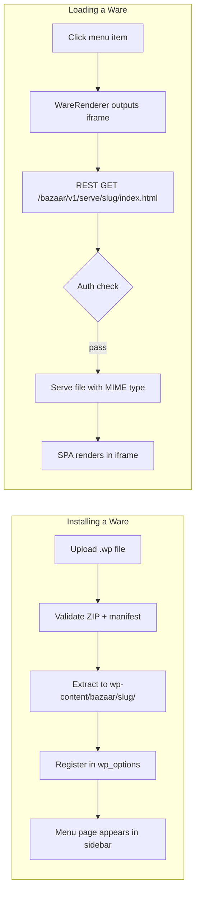

<div align="center">

# Bazaar

**Turn `wp-admin` into an app marketplace.**


Install any HTML/CSS/JS app into WordPress with a single file upload. It shows up in your sidebar. That's it.

```
invoice-generator.wp   →   upload   →   "Invoices" appears in your sidebar
```

*No shortcodes. No page templates. No style conflicts. Just apps.*

</div>

---

## Table of Contents

- [Why This Exists](#why-this-exists)
- [The Name](#the-name)
- [What is a Ware?](#what-is-a-ware)
- [How It Works](#how-it-works)
- [Installation](#installation)
- [Building Your First Ware](#building-your-first-ware)
- [@bazaar/client](#bazaarclient)
- [Dev Mode](#dev-mode)
- [WP-CLI](#wp-cli)
- [Security](#security)
- [REST API](#rest-api)
- [Development](#development)
- [Documentation](#documentation)

---

## Why This Exists

We're living through a genuinely strange and exciting moment in software. AI has changed what it means to write code — the pace of ideas, the speed of prototypes, the sheer *fun* of it. Coding is my full-time job, my obsession, and my hobby all at once, and right now that feels like the best possible thing to be.

The problem I kept running into: every time I had a new idea, I'd spin up a new server. A new domain, a new deploy pipeline, a new VPS — just to run something I wanted to play with. It was friction that didn't need to exist.

WordPress is my digital home. It's where I've lived on the web for years, where my content lives, where I feel at home in the stack. And I started thinking — why isn't this my app platform too? Why am I spinning up infrastructure elsewhere when I've already got a perfectly good authenticated, multi-user, extensible web application sitting right there?

That's where Bazaar came from. Build something cool, package it, drop it into your WordPress admin. No new servers. No new domains. No new deploys. Your WordPress install becomes the platform for everything you're building.

It was born out of the AI moment — the abundance of ideas, the joy of building fast — and the very practical desire to stop managing infrastructure every time inspiration strikes.

---

## The Name

In 1997, Eric S. Raymond wrote *[The Cathedral and the Bazaar](http://www.catb.org/~esr/writings/cathedral-bazaar/)* — one of the most influential essays in software history. He described two models of building software:

> **The Cathedral** — code released on a controlled schedule by a small group, with source guarded closely between releases. Careful, coordinated, monolithic.
>
> **The Bazaar** — code released early and often, developed in the open where *"a great babbling bazaar of differing agendas and approaches"* produces something no single team could plan in advance.

Raymond's insight was that the bazaar model produces *better* software — because *"given enough eyeballs, all bugs are shallow."*

`wp-admin` is a cathedral. Adding real functionality to it means navigating a gauntlet of PHP templates, action hooks, capability checks, and menu registration APIs. The core team controls the architecture and everyone else works around it.

**This plugin is the bazaar.** Build your app however you want, in whatever stack you prefer. Package it. Upload it. It appears in the sidebar. The WordPress admin becomes a platform that anyone can extend with a ZIP file — not just the teams who know every hook and filter by heart.

WordPress itself was built bazaar-style. This plugin brings that spirit back to the admin dashboard.

---

## What is a Ware?

A **ware** is a `.wp` file — a renamed ZIP archive containing a self-contained web app and a `manifest.json`. Think `.apk` for Android, but for WordPress.

```
invoice-generator.wp
├── manifest.json      ← name, slug, menu placement, permissions
├── icon.svg           ← sidebar icon
├── index.html         ← your app's entry point
└── assets/
    ├── app.js
    └── app.css
```

Build your app in React, Vue, Svelte, vanilla JS — anything that compiles to HTML/CSS/JS. Add a manifest. ZIP it. Rename it `.wp`. Upload it. Done.

---

## How It Works

Each ware gets its own **full-screen sandboxed iframe** as a WordPress admin page. Your app renders exactly as it would standalone — zero style bleed from wp-admin, zero JavaScript conflicts.



Wares are stored in `wp-content/bazaar/` (outside the plugin directory, so they survive plugin updates). All files are served through an authenticated REST endpoint — no direct filesystem access.

---

## Installation

> [!NOTE]
> **Requirements:** PHP 8.2+, WordPress 6.6+

- [ ] Download the latest release zip
- [ ] Upload via **Plugins → Add New → Upload Plugin**
- [ ] Activate the plugin
- [ ] A **Bazaar** item appears at the top of your admin sidebar

**Or via WP-CLI:**

```bash
wp plugin install bazaar --activate
```

---

## Building Your First Ware

### Option A — scaffold with `create-ware`

```bash
npm create ware@latest
```

The interactive CLI asks for your ware name and preferred stack (vanilla TS, React, Vue), then generates a ready-to-go project with `manifest.json`, a Vite config, and a `package` script that outputs a `.wp` file.

### Option B — manual setup

#### 1. Build your app

Use any framework or none at all. Build it like any static web app.

```bash
# React + Vite example
npm create vite@latest my-ware -- --template react
cd my-ware && npm install && npm run build
```

#### 2. Add a manifest

Create `manifest.json` at the root of your build output:

```json
{
  "name": "Invoice Generator",
  "slug": "invoice-generator",
  "version": "1.0.0",
  "author": "Your Name",
  "description": "Generate and manage invoices from wp-admin.",
  "icon": "icon.svg",
  "entry": "index.html",
  "menu": {
    "title": "Invoices",
    "position": 30,
    "capability": "manage_options"
  }
}
```

#### 3. Package it

```bash
cd build/
zip -r ../invoice-generator.wp .
```

Or add a `package` script to your `package.json`:

```json
{
  "scripts": {
    "package": "npm run build && cd build && zip -r ../invoice-generator.wp ."
  }
}
```

#### 4. Upload

Go to **Bazaar** in your WordPress sidebar → drag and drop your `.wp` file → done.

> [!TIP]
> See [Building a Ware](docs/Building-a-Ware.md) for the full guide including React, Vue, Svelte recipes and how to call the WordPress REST API from inside your ware.

---

## @bazaar/client

`@bazaar/client` is a TypeScript library that handles all the WordPress plumbing so you can focus on your app. Install it in your ware project:

```bash
npm install @bazaar/client
```

**Framework-agnostic core:**

```ts
import { getBazaarContext, wpJson } from '@bazaar/client';

const ctx = getBazaarContext();
// { nonce, restUrl, serveUrl, slug, adminColor }

// Authenticated fetch — nonce added automatically
const posts = await wpJson('/wp/v2/posts?per_page=5');
```

**React hooks:**

```tsx
import { useCurrentUser, useWpPosts } from '@bazaar/client/react';

function App() {
  const user = useCurrentUser();
  const { posts, loading } = useWpPosts({ per_page: 10 });

  if (loading) return <p>Loading…</p>;
  return <div>{posts.map(p => <h2 key={p.id}>{p.title.rendered}</h2>)}</div>;
}
```

See the [`packages/client`](packages/client/README.md) readme for the full API reference.

---

## Dev Mode

Run your ware against a live WordPress install during development — no packaging, no uploading, instant hot-reload.

```bash
# Start your ware's Vite dev server (port 5173)
npm run dev

# Tell Bazaar to proxy to it
wp bazaar dev start invoice-generator http://localhost:5173
```

Bazaar replaces the ware's iframe `src` with your dev server URL. Save a file in your editor → the iframe reloads in milliseconds. Use `wp bazaar dev stop invoice-generator` to go back to the installed build.

---

## WP-CLI

Bazaar ships with a full WP-CLI command suite:

**Lifecycle**

```bash
wp bazaar list-wares                                   # list all wares
wp bazaar list-wares --status=enabled --format=json    # filter + format
wp bazaar install invoice-generator.wp                 # install from a file
wp bazaar install invoice-generator.wp --force         # upgrade (overwrites)
wp bazaar enable  invoice-generator                    # enable a ware
wp bazaar disable invoice-generator                    # disable a ware
wp bazaar delete  invoice-generator --yes              # delete ware + files
wp bazaar info    invoice-generator                    # show ware metadata
```

**Registry & updates**

```bash
wp bazaar search crm                                   # search remote registry
wp bazaar outdated                                     # wares with updates
wp bazaar update invoice-generator                     # update one ware
wp bazaar update --all                                 # update everything
```

**Operations**

```bash
wp bazaar dev start invoice-generator                  # start dev mode
wp bazaar dev stop  invoice-generator                  # stop dev mode
wp bazaar license set   invoice-generator XXXX-YYYY    # set license key
wp bazaar license check invoice-generator              # validate key
wp bazaar analytics invoice-generator --days=30        # usage stats
wp bazaar doctor    --slug=invoice-generator           # health checks
wp bazaar logs      invoice-generator --count=50       # error log
wp bazaar audit     invoice-generator                  # audit trail
wp bazaar csp       invoice-generator                  # view/edit CSP policy
wp bazaar bundle    my-bundle.wpbundle                 # install a bundle
```

**Developer tools**

```bash
wp bazaar scaffold endpoint sync_orders                # generate REST stub
wp bazaar types invoice-generator                      # emit TypeScript types
wp bazaar sign  invoice-generator.wp --key=private.pem # sign a ware
wp bazaar keypair                                      # generate RSA keypair
```

See [docs/WP-CLI.md](docs/WP-CLI.md) for the full reference and scripting patterns.

---

## Security

Bazaar is built with security as a first-class concern:

| Threat | Mitigation |
|:---|:---|
| PHP execution in wares | Upload validator rejects `.php`, `.phar`, `.phtml`; `.htaccess` disables PHP engine as second layer |
| Unauthenticated file access | All ware files served through `GET /bazaar/v1/serve/` — requires login + capability |
| Path traversal | `realpath()` confinement; `..` in file paths rejected at route level |
| CSRF | `X-WP-Nonce` on all mutations via `@wordpress/api-fetch` |
| iframe escaping | `sandbox="allow-scripts allow-forms allow-same-origin allow-popups"` |
| Outbound network abuse | Zero-trust service worker intercepts all fetch calls from within a ware and enforces `permissions.network` allowlist |
| Storage abuse | Configurable uncompressed size cap (default 50 MB per ware) |
| Signed wares | Optional RSA signature verification on install (`wp bazaar sign` + `keypair`) |

> [!WARNING]
> Wares have `allow-same-origin` in the sandbox so they can make authenticated REST requests to WordPress. This is intentional and necessary — but it means you should only install wares from sources you trust, the same way you would a plugin.

---

## REST API

All ware management goes through REST — no `admin-ajax.php`. Endpoints are grouped by concern:

| Group | Endpoints |
|:---|:---|
| **Wares** | `GET/POST /wares` · `GET/PATCH/DELETE /wares/{slug}` · `GET /index` |
| **File serving** | `GET /serve/{slug}/{file}` |
| **Config** | `GET/PATCH /config/{slug}` · `DELETE /config/{slug}/{key}` |
| **Health** | `GET /health` · `GET /health/{slug}` |
| **Analytics** | `GET/POST /analytics` · `GET /analytics/{slug}` |
| **Audit** | `GET/POST /audit` · `GET /audit/{slug}` |
| **Badges** | `GET /badges` · `POST/DELETE /badges/{slug}` |
| **CSP** | `GET/PATCH/DELETE /csp/{slug}` |
| **Errors** | `GET/POST/DELETE /errors` · `DELETE /errors/{id}` |
| **Jobs** | `GET /jobs/{slug}` · `POST /jobs/{slug}/{job_id}` |
| **Nonce** | `GET /nonce` |
| **Storage** | `GET/DELETE /store/{slug}` · `GET/PUT/DELETE /store/{slug}/{key}` |
| **Stream (SSE)** | `GET /stream` |
| **Webhooks** | `GET/POST /webhooks/{slug}` · `DELETE /webhooks/{slug}/{id}` |

**Base URL:** `/wp-json/bazaar/v1`

See [docs/REST-API.md](docs/REST-API.md) for the full endpoint reference including request/response shapes, auth requirements, and error codes.

---

## Development

```bash
git clone https://github.com/nickhblair/bazaar
cd bazaar

composer install   # PHP deps: PHPCS, PHPStan, PHPUnit
npm install        # JS deps: Vite, @wordpress/scripts

npm run build      # compile admin/dist/

composer lint && npm run lint   # lint everything
composer test && npm test       # run tests

npx wp-env start   # local WP environment
```

<details>
<summary><strong>Project structure</strong></summary>

```
bazaar/
├── bazaar.php                      ← Plugin bootstrap + constants
├── src/
│   ├── class-plugin.php            ← Hook registration + DI wiring
│   ├── class-ware-registry.php     ← Two-tier wp_options storage
│   ├── class-ware-loader.php       ← ZIP validation + WP_Filesystem extraction
│   ├── class-ware-renderer.php     ← iframe output
│   ├── class-ware-updater.php      ← Auto-update scheduler + runner
│   ├── class-ware-bundler.php      ← .wpbundle multi-ware archives
│   ├── class-ware-license.php      ← License key storage + remote validation
│   ├── class-ware-signer.php       ← RSA signature verification
│   ├── class-menu-manager.php      ← Dynamic admin menus
│   ├── class-bazaar-page.php       ← The Bazaar admin page (gallery + upload)
│   ├── class-bazaar-shell.php      ← The persistent shell SPA template
│   ├── class-remote-registry.php   ← Remote ware registry + update checks
│   ├── class-multisite.php         ← Multisite index merging
│   ├── class-audit-log.php         ← Audit log helper
│   ← class-csp-policy.php         ← CSP builder
│   ├── class-webhook-dispatcher.php← Outbound webhook dispatcher
│   ├── Blocks/
│   │   └── class-ware-block.php    ← Gutenberg block for embedding wares
│   ├── Db/
│   │   └── Tables.php              ← Custom table schema (analytics, errors)
│   ├── CLI/
│   │   ├── class-bazaar-command.php← WP-CLI command root
│   │   └── Traits/
│   │       ├── WareLifecycleTrait.php  ← install/enable/disable/delete/update
│   │       ├── WareDevTrait.php        ← dev/scaffold/sign/keypair/types
│   │       └── WareOpsTrait.php        ← license/analytics/doctor/logs/audit/csp
│   └── REST/
│       ├── class-bazaar-controller.php ← Base controller (shared permission helpers)
│       ├── class-ware-server.php       ← Authenticated static file server
│       ├── class-upload-controller.php ← Upload handler
│       ├── class-ware-controller.php   ← List / toggle / delete
│       ├── class-analytics-controller.php
│       ├── class-audit-controller.php
│       ├── class-badge-controller.php
│       ├── class-config-controller.php
│       ├── class-csp-controller.php
│       ├── class-errors-controller.php
│       ├── class-health-controller.php
│       ├── class-jobs-controller.php
│       ├── class-nonce-controller.php
│       ├── class-storage-controller.php
│       ├── class-stream-controller.php
│       └── class-webhooks-controller.php
├── admin/src/                      ← Vite source (shell SPA + CSS)
│   ├── shell.js                    ← Main shell application
│   ├── shell.css
│   ├── zero-trust-sw.js            ← Service worker (network allowlist)
│   └── modules/                    ← Shell sub-modules (nav, views, inspector…)
├── blocks/ware/                    ← Gutenberg block definition
├── create-ware/                    ← `npm create ware@latest` CLI scaffolder
├── packages/client/                ← @bazaar/client TypeScript library
├── templates/                      ← PHP templates
└── docs/                           ← Developer documentation
```

</details>

---

## Documentation

| Doc | Description |
|:---|:---|
| [Building a Ware](docs/Building-a-Ware.md) | Complete guide to developing `.wp` apps — vanilla JS, React, Vue, Svelte, and WordPress REST auth patterns |
| [Manifest Reference](docs/Manifest-Reference.md) | Every `manifest.json` field documented with types, defaults, and menu position cheat sheet |
| [REST API](docs/REST-API.md) | Full endpoint reference: all 35+ routes, request/response shapes, auth requirements, and error codes |
| [WP-CLI](docs/WP-CLI.md) | CLI command reference with scripting recipes and multi-site patterns |
| [WordPress Shell](docs/WordPress-Shell.md) | WP-CLI power guide: `wp shell`, PsySH, `wp eval`, automation, must-have packages |

---

<div align="center">

GPL-2.0-or-later &nbsp;·&nbsp; Built on the shoulders of [The Cathedral and the Bazaar](http://www.catb.org/~esr/writings/cathedral-bazaar/)

</div>
