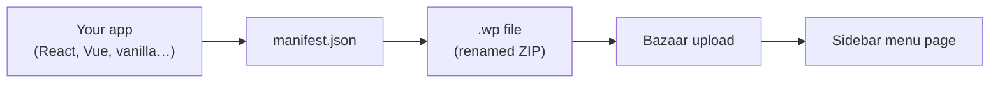

# Building a Ware

A **ware** is any web app packaged as a `.wp` file (a renamed ZIP archive) with a `manifest.json`. Once uploaded to Bazaar, it appears as a full-screen menu page in `wp-admin` — completely isolated from WordPress's own styles and scripts.

---

## Table of Contents

- [The Mental Model](#the-mental-model)
- [Anatomy of a Ware](#anatomy-of-a-ware)
- [Quickstart: Vanilla JS](#quickstart-vanilla-js)
- [Building with a Framework](#building-with-a-framework)
- [Communicating with WordPress](#communicating-with-wordpress)
- [iframe Sandbox Capabilities](#iframe-sandbox-capabilities)
- [Updating a Ware](#updating-a-ware)
- [Debugging Tips](#debugging-tips)

---

## The Mental Model

The name comes from Eric S. Raymond's essay *[The Cathedral and the Bazaar](http://www.catb.org/~esr/writings/cathedral-bazaar/)*. The cathedral is `wp-admin` as it exists today — monolithic, controlled, extended only through its own architecture. Bazaar makes the admin a platform where anyone can contribute an app without understanding WordPress internals.

**Your ware is just a website.** It runs in a sandboxed `<iframe>` inside `wp-admin`. You have full control over HTML, CSS, and JS. The only WordPress knowledge you need is writing `manifest.json`.



---

## Anatomy of a Ware

```
my-ware.wp                ← renamed .zip
├── manifest.json         ← REQUIRED — ware metadata
├── index.html            ← REQUIRED — entry point
├── icon.svg              ← optional sidebar icon (20×20 recommended)
└── assets/
    ├── app.js
    ├── app.css
    └── logo.png
```

> [!IMPORTANT]
> `manifest.json` must exist at the **root level** of the ZIP — not inside a subdirectory. The same applies to the entry HTML file unless you set a path in `manifest.json`.

---

## Quickstart: Vanilla JS

The fastest possible ware — no build step, no dependencies, no tooling.

**1. `manifest.json`**

```json
{
  "name": "Hello Ware",
  "slug": "hello-ware",
  "version": "1.0.0",
  "author": "Your Name",
  "entry": "index.html",
  "menu": {
    "title": "Hello",
    "position": 99
  }
}
```

**2. `index.html`**

```html
<!DOCTYPE html>
<html lang="en">
<head>
  <meta charset="UTF-8">
  <meta name="viewport" content="width=device-width, initial-scale=1">
  <title>Hello Ware</title>
  <style>
    body {
      font-family: system-ui;
      display: flex;
      align-items: center;
      justify-content: center;
      height: 100vh;
      margin: 0;
    }
    h1 { color: #2271b1; }
  </style>
</head>
<body>
  <h1>Hello from Bazaar!</h1>
</body>
</html>
```

**3. Package and upload**

```bash
zip hello-ware.wp manifest.json index.html
# Upload in the Bazaar admin page
```

**"Hello" now appears in your sidebar.** That's the entire workflow.

---

## Building with a Framework

Wares work with any framework that produces static output.

<details>
<summary><strong>React (Vite)</strong></summary>

```bash
npm create vite@latest my-ware -- --template react
cd my-ware && npm install && npm run build
cp manifest.json dist/
cd dist && zip -r ../../my-ware.wp . && cd ../..
```

</details>

<details>
<summary><strong>Vue</strong></summary>

```bash
npm create vue@latest my-ware
cd my-ware && npm install && npm run build
cp manifest.json dist/
cd dist && zip -r ../../my-ware.wp . && cd ../..
```

</details>

<details>
<summary><strong>Svelte / SvelteKit (static adapter)</strong></summary>

```bash
npx sv create my-ware
cd my-ware && npm install && npm run build
cp manifest.json build/
cd build && zip -r ../../my-ware.wp . && cd ../..
```

</details>

### Add a `package` script

Save yourself the manual steps by adding a `package` script to your `package.json`:

```json
{
  "scripts": {
    "build": "vite build",
    "package": "npm run build && cp manifest.json dist/ && cd dist && zip -r ../../$(node -p \"require('../manifest.json').slug\").wp . && cd .."
  }
}
```

```bash
npm run package   # builds + zips in one step
```

---

## Communicating with WordPress

Your ware runs in a sandboxed iframe on the **same origin** as WordPress (served via the Bazaar REST endpoint). That means you can make authenticated requests to any WordPress REST API endpoint.

### Getting the nonce

The iframe `src` URL includes a `_wpnonce` query parameter. Read it from the URL:

```js
const nonce = new URLSearchParams( window.location.search ).get( '_wpnonce' );
```

### Querying WordPress data

```js
const nonce = new URLSearchParams( window.location.search ).get( '_wpnonce' );

// Fetch posts
const posts = await fetch( '/wp-json/wp/v2/posts', {
  headers: { 'X-WP-Nonce': nonce },
} ).then( r => r.json() );

// Get current user
const me = await fetch( '/wp-json/wp/v2/users/me', {
  headers: { 'X-WP-Nonce': nonce },
} ).then( r => r.json() );
```

### Writing data back to WordPress

```js
await fetch( '/wp-json/wp/v2/posts', {
  method: 'POST',
  headers: {
    'Content-Type': 'application/json',
    'X-WP-Nonce': nonce,
  },
  body: JSON.stringify({ title: 'My Post', status: 'publish' }),
} );
```

### Finding the REST base URL

> [!TIP]
> Don't hardcode `/wp-json/`. WordPress can be installed in a subdirectory. Extract the base URL from the iframe's `src` instead:

```js
// The iframe src is: https://example.com/wp-json/bazaar/v1/serve/my-ware/index.html
const wpRoot  = window.location.href.split( '/wp-json/' )[ 0 ];
const restBase = wpRoot + '/wp-json';
```

---

## iframe Sandbox Capabilities

Bazaar renders wares with this sandbox policy:

```html
sandbox="allow-scripts allow-forms allow-same-origin allow-popups allow-downloads"
```

| Permission | What It Enables |
|:---|:---|
| `allow-scripts` | Run JavaScript |
| `allow-forms` | Submit HTML forms |
| `allow-same-origin` | Make authenticated `fetch` requests to WordPress |
| `allow-popups` | Open links in new tabs |
| `allow-downloads` | Trigger file downloads |

> [!NOTE]
> `allow-top-navigation` and `allow-modals` are intentionally excluded. Wares cannot redirect the whole page or call `alert()` / `confirm()`.

---

## Updating a Ware

To upgrade an installed ware, use the `--force` flag:

```bash
wp bazaar install my-ware-v2.wp --force
```

Or from the admin UI: delete the old ware, then upload the new one.

> [!NOTE]
> A GUI update flow with version comparison is on the roadmap.

---

## Debugging Tips

- **DevTools work normally.** The ware iframe is fully inspectable — set breakpoints, inspect network requests, and read console output as you would any web app.
- **HTTP status codes are meaningful.** `401` = not logged in. `403` = insufficient capability or ware is disabled. `404` = file path wrong.
- **Inspect the registry** with `wp bazaar info <slug>` to see exactly what Bazaar has stored.
- **Disable asset caching** in development by setting `SCRIPT_DEBUG=true` and `WP_DEBUG=true` in `wp-config.php` (or use `.wp-env.json`).
- **Tail the debug log** with `wp eval 'echo WP_CONTENT_DIR;'` to find the path, then `tail -f <path>/debug.log`.

---

## Next Steps

- [Manifest Reference](Manifest-Reference.md) — every `manifest.json` field explained
- [REST API](REST-API.md) — full endpoint docs and ware-to-WordPress patterns
- [WP-CLI](WP-CLI.md) — install and manage wares from the terminal
